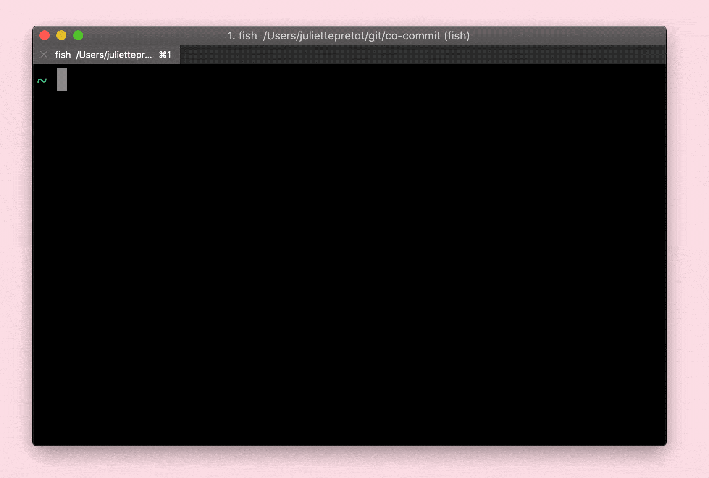

# 🤝 co-commit

Co-author GitHub commits with ease.

Run `npx co-commit` to start.

## 🤓 Background

GitHub allows you to [co-author commits](https://help.github.com/articles/creating-a-commit-with-multiple-authors/) by appending `Co-authored-by: name <name@example.com>` to a commit message.

## 🧠 Advanced (optional)

To speed up your workflow you can preinstall co-commit using `npm i -g co-commit`.

## ⛓ Dependencies

Having `git` and `node` installed.

## Contributors

- [mariiapunda](https://github.com/MariiaPunda) 👩‍💻
- [juliettepretot](https://github.com/juliettepretot) 👩‍💻
